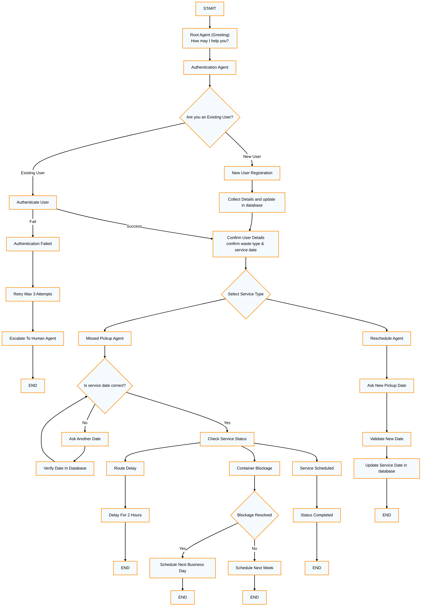

```mermaid
%%{init: {
  "theme": "base",
  "themeVariables": {
    "primaryColor": "#F5FAFF",
    "primaryBorderColor": "#FF8C00",
    "primaryTextColor": "#000000",
    "lineColor": "#000000",
    "edgeLabelBackground": "#FFFFFF"
  }
}}%%

flowchart TB

classDef default fill:#F5FAFF,stroke:#FF8C00,stroke-width:2px,color:#000000;
linkStyle default stroke:#000000,stroke-width:2px;

A["START"] --> B["Root Agent (Greeting)<br>How may I help you?"]
B --> C["Authentication Agent"]
C --> D{"Are you an Existing User?"}

D -- Existing User --> E["Authenticate User"]
D -- New User --> F["New User Registration"]

F --> G["Collect Details and update in database"]
G --> H["Confirm User Details<br>confirm waste type & service date"]

E -- Fail --> I["Authentication Failed"]
I --> J["Retry Max 3 Attempts"]
J --> K["Escalate To Human Agent"]
K --> L["END"]

E -- Success --> H

H --> M{"Select Service Type"}

M --> N["Missed Pickup Agent"]
M --> O["Reschedule Agent"]

N --> P{"Is service date correct?"}

P -- No --> Q["Ask Another Date"]
Q --> R["Verify Date In Database"]
R --> P

P -- Yes --> S["Check Service Status"]

S --> T["Route Delay"]
S --> U["Container Blockage"]
S --> V["Service Scheduled"]

T --> W["Delay For 2 Hours"]
W --> X["END"]

U --> Y{"Blockage Resolved"}

Y -- Yes --> Z["Schedule Next Business Day"]
Y -- No --> AA["Schedule Next Week"]

Z --> AB["END"]
AA --> AC["END"]

V --> AD["Status Completed"]
AD --> AE["END"]

O --> AK["Ask New Pickup Date"]
AK --> AL["Validate New Date"]
AL --> AM["Update Service Date in database"]

AM --> N1["END"]
```
