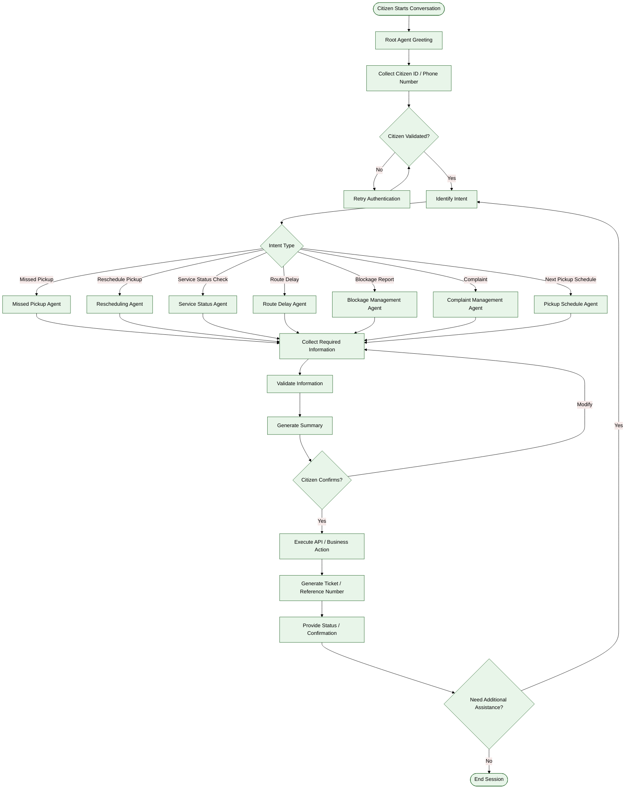

## Waste Management Agent - End-to-End Golden Path Flow

```mermaid
%%{init: {'theme':'base','themeVariables':{
'primaryColor':'#E8F5E9',
'primaryBorderColor':'#1B5E20',
'primaryTextColor':'#000000',
'lineColor':'#000000'
}}}%%

flowchart TD

    A([Citizen Starts Conversation])
    --> B[Root Agent Greeting]

    B --> C[Collect Citizen ID / Phone Number]

    C --> D{Citizen Validated?}

    D -->|No| E[Retry Authentication]

    E --> D

    D -->|Yes| F[Identify Intent]

    F --> G{Intent Type}

    G -->|Missed Pickup| H[Missed Pickup Agent]

    G -->|Reschedule Pickup| I[Rescheduling Agent]

    G -->|Service Status Check| J[Service Status Agent]

    G -->|Route Delay| K[Route Delay Agent]

    G -->|Blockage Report| L[Blockage Management Agent]

    G -->|Complaint| M[Complaint Management Agent]

    G -->|Next Pickup Schedule| N[Pickup Schedule Agent]

    H --> O[Collect Required Information]
    I --> O
    J --> O
    K --> O
    L --> O
    M --> O
    N --> O

    O --> P[Validate Information]

    P --> Q[Generate Summary]

    Q --> R{Citizen Confirms?}

    R -->|Modify| O

    R -->|Yes| S[Execute API / Business Action]

    S --> T[Generate Ticket / Reference Number]

    T --> U[Provide Status / Confirmation]

    U --> V{Need Additional Assistance?}

    V -->|Yes| F

    V -->|No| W([End Session])

```
