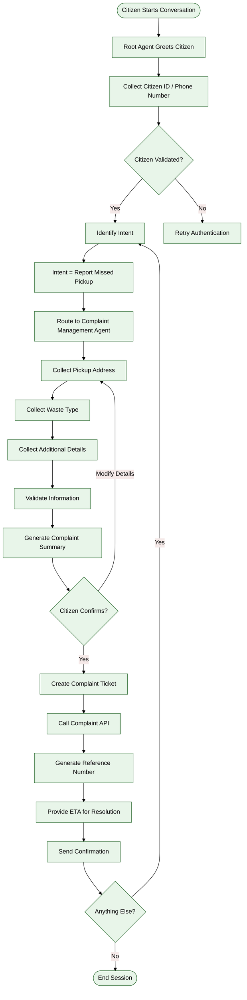

### Happy Path 1 (Missed Pickup reporting)

```mermaid
%%{init: {'theme':'base','themeVariables':{
'primaryColor':'#E8F5E9',
'primaryBorderColor':'#1B5E20',
'primaryTextColor':'#000000',
'lineColor':'#000000'
}}}%%
flowchart TD

    A([Citizen Starts Conversation]) --> B[Root Agent Greets Citizen]

    B --> C[Collect Citizen ID / Phone Number]

    C --> D{Citizen Validated?}

    D -->|Yes| E[Identify Intent]
    D -->|No| F[Retry Authentication]

    E --> G[Intent = Report Missed Pickup]

    G --> H[Route to Complaint Management Agent]

    H --> I[Collect Pickup Address]

    I --> J[Collect Waste Type]

    J --> K[Collect Additional Details]

    K --> L[Validate Information]

    L --> M[Generate Complaint Summary]

    M --> N{Citizen Confirms?}

    N -->|Yes| O[Create Complaint Ticket]

    N -->|Modify Details| I

    O --> P[Call Complaint API]

    P --> Q[Generate Reference Number]

    Q --> R[Provide ETA for Resolution]

    R --> S[Send Confirmation]

    S --> T{Anything Else?}

    T -->|Yes| E

    T -->|No| U([End Session])

```
