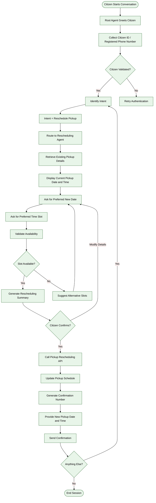

## Happy Path 02 (Rescheduling)

```mermaid
%%{init: {'theme':'base','themeVariables':{
'primaryColor':'#E8F5E9',
'primaryBorderColor':'#1B5E20',
'primaryTextColor':'#000000',
'lineColor':'#000000'
}}}%%
flowchart TD

    A([Citizen Starts Conversation])
    --> B[Root Agent Greets Citizen]

    B --> C[Collect Citizen ID / Registered Phone Number]

    C --> D{Citizen Validated?}

    D -->|Yes| E[Identify Intent]
    D -->|No| F[Retry Authentication]

    E --> G[Intent = Reschedule Pickup]

    G --> H[Route to Rescheduling Agent]

    H --> I[Retrieve Existing Pickup Details]

    I --> J[Display Current Pickup Date and Time]

    J --> K[Ask for Preferred New Date]

    K --> L[Ask for Preferred Time Slot]

    L --> M[Validate Availability]

    M --> N{Slot Available?}

    N -->|Yes| O[Generate Rescheduling Summary]

    N -->|No| P[Suggest Alternative Slots]

    P --> K

    O --> Q{Citizen Confirms?}

    Q -->|Yes| R[Call Pickup Rescheduling API]

    Q -->|Modify Details| K

    R --> S[Update Pickup Schedule]

    S --> T[Generate Confirmation Number]

    T --> U[Provide New Pickup Date and Time]

    U --> V[Send Confirmation]

    V --> W{Anything Else?}

    W -->|Yes| E

    W -->|No| X([End Session])

```
