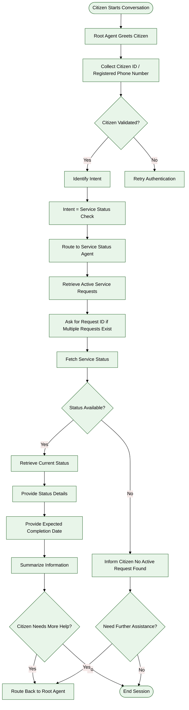

## Happy Path 03 (Servic Status Check)

```mermaid
%%{init: {'theme':'base','themeVariables':{
'primaryColor':'#E8F5E9',
'primaryBorderColor':'#1B5E20',
'primaryTextColor':'#000000',
'lineColor':'#000000'
}}}%%
flowchart TD

    A([Citizen Starts Conversation])
    --> B[Root Agent Greets Citizen]

    B --> C[Collect Citizen ID / Registered Phone Number]

    C --> D{Citizen Validated?}

    D -->|Yes| E[Identify Intent]
    D -->|No| F[Retry Authentication]

    E --> G[Intent = Service Status Check]

    G --> H[Route to Service Status Agent]

    H --> I[Retrieve Active Service Requests]

    I --> J[Ask for Request ID if Multiple Requests Exist]

    J --> K[Fetch Service Status]

    K --> L{Status Available?}

    L -->|Yes| M[Retrieve Current Status]

    L -->|No| N[Inform Citizen No Active Request Found]

    M --> O[Provide Status Details]

    O --> P[Provide Expected Completion Date]

    P --> Q[Summarize Information]

    Q --> R{Citizen Needs More Help?}

    R -->|Yes| S[Route Back to Root Agent]

    R -->|No| T([End Session])

    N --> U{Need Further Assistance?}

    U -->|Yes| S

    U -->|No| T

```
