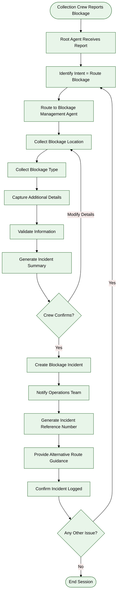

## Happy Path 05 (Blockage)

```mermaid
%%{init: {'theme':'base','themeVariables':{
'primaryColor':'#E8F5E9',
'primaryBorderColor':'#1B5E20',
'primaryTextColor':'#000000',
'lineColor':'#000000'
}}}%%

flowchart TD

    A([Collection Crew Reports Blockage])
    --> B[Root Agent Receives Report]

    B --> C[Identify Intent = Route Blockage]

    C --> D[Route to Blockage Management Agent]

    D --> E[Collect Blockage Location]

    E --> F[Collect Blockage Type]

    F --> G[Capture Additional Details]

    G --> H[Validate Information]

    H --> I[Generate Incident Summary]

    I --> J{Crew Confirms?}

    J -->|Yes| K[Create Blockage Incident]

    J -->|Modify Details| E

    K --> L[Notify Operations Team]

    L --> M[Generate Incident Reference Number]

    M --> N[Provide Alternative Route Guidance]

    N --> O[Confirm Incident Logged]

    O --> P{Any Other Issue?}

    P -->|Yes| C

    P -->|No| Q([End Session])

```
