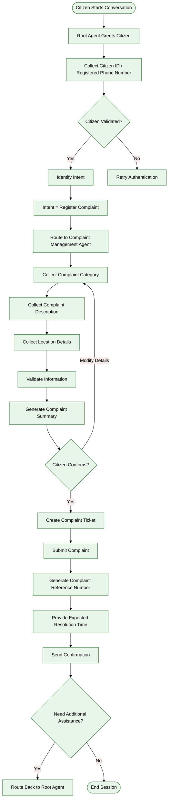

## Happy Path 05 (Complaint)

```mermaid
%%{init: {'theme':'base','themeVariables':{
'primaryColor':'#E8F5E9',
'primaryBorderColor':'#1B5E20',
'primaryTextColor':'#000000',
'lineColor':'#000000'
}}}%%

flowchart TD

    A([Citizen Starts Conversation])
    --> B[Root Agent Greets Citizen]

    B --> C[Collect Citizen ID / Registered Phone Number]

    C --> D{Citizen Validated?}

    D -->|Yes| E[Identify Intent]
    D -->|No| F[Retry Authentication]

    E --> G[Intent = Register Complaint]

    G --> H[Route to Complaint Management Agent]

    H --> I[Collect Complaint Category]

    I --> J[Collect Complaint Description]

    J --> K[Collect Location Details]

    K --> L[Validate Information]

    L --> M[Generate Complaint Summary]

    M --> N{Citizen Confirms?}

    N -->|Yes| O[Create Complaint Ticket]

    N -->|Modify Details| I

    O --> P[Submit Complaint]

    P --> Q[Generate Complaint Reference Number]

    Q --> R[Provide Expected Resolution Time]

    R --> S[Send Confirmation]

    S --> T{Need Additional Assistance?}

    T -->|Yes| U[Route Back to Root Agent]

    T -->|No| V([End Session])

```
