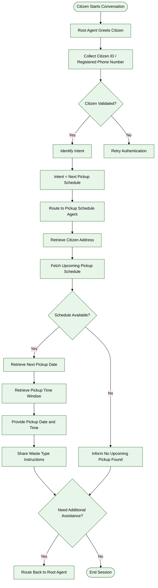

## Happy Path 07 (Next Pickup)

```mermaid
%%{init: {'theme':'base','themeVariables':{
'primaryColor':'#E8F5E9',
'primaryBorderColor':'#1B5E20',
'primaryTextColor':'#000000',
'lineColor':'#000000'
}}}%%

flowchart TD

    A([Citizen Starts Conversation])
    --> B[Root Agent Greets Citizen]

    B --> C[Collect Citizen ID / Registered Phone Number]

    C --> D{Citizen Validated?}

    D -->|Yes| E[Identify Intent]
    D -->|No| F[Retry Authentication]

    E --> G[Intent = Next Pickup Schedule]

    G --> H[Route to Pickup Schedule Agent]

    H --> I[Retrieve Citizen Address]

    I --> J[Fetch Upcoming Pickup Schedule]

    J --> K{Schedule Available?}

    K -->|Yes| L[Retrieve Next Pickup Date]

    L --> M[Retrieve Pickup Time Window]

    M --> N[Provide Pickup Date and Time]

    N --> O[Share Waste Type Instructions]

    O --> P{Need Additional Assistance?}

    P -->|Yes| Q[Route Back to Root Agent]

    P -->|No| R([End Session])

    K -->|No| S[Inform No Upcoming Pickup Found]

    S --> P

```
